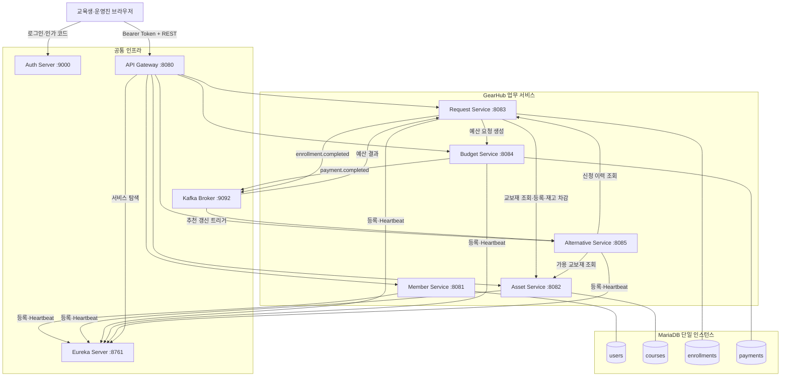
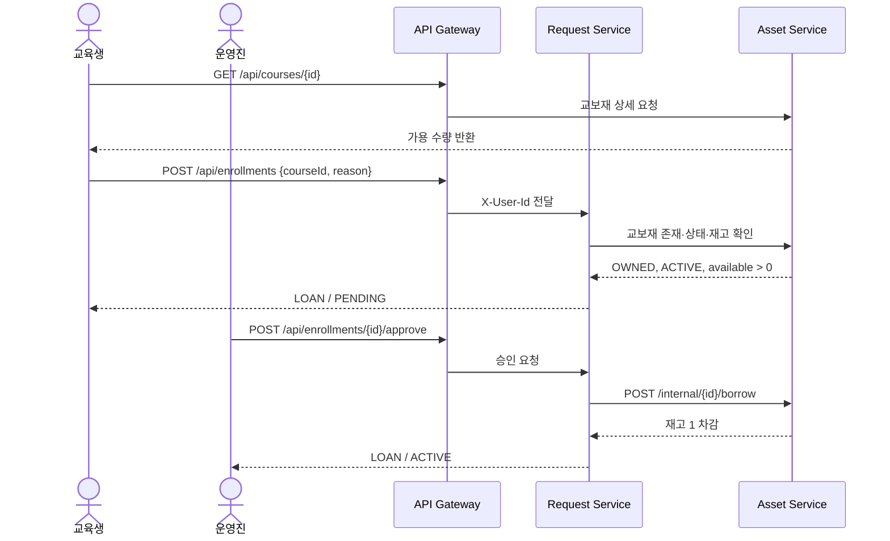
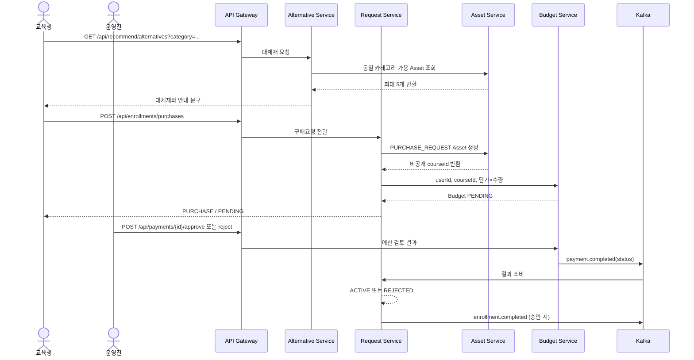
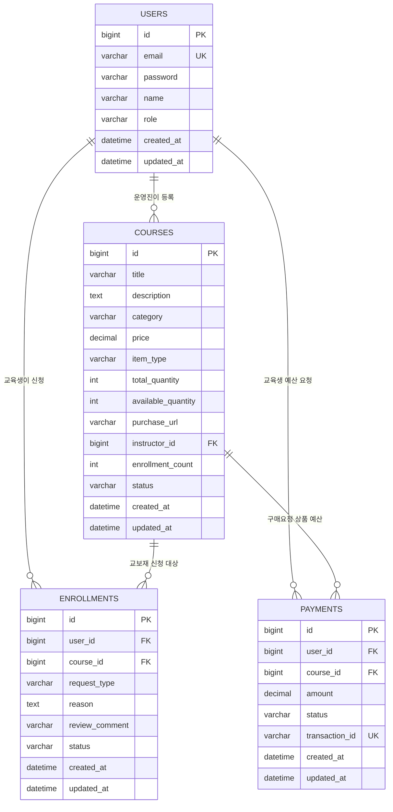

# 아키텍처와 ERD

## 1. 설계 원칙

- 가이드 3의 단일 MariaDB·테이블 단위 분리 구조를 유지한다.
- 업무 서비스는 자신의 테이블만 쓰는 것으로 논리적 소유권을 정한다.
- 즉시 확인이 필요한 요청은 REST, 느슨한 상태 전파는 Kafka를 사용한다.
- 제공 인프라(Auth, Gateway, Eureka)의 내부 구현은 수정하지 않는다.
- 기존 포트와 API 경로를 유지해 프론트·인프라 계약을 깨지 않는다.

### ADR-001: 왜 이번 실습에서 MSA를 유지하는가

MSA가 B2B 장비 관리에 무조건 필요한 정답이어서 선택한 것은 아니다. 이틀짜리 신규 서비스라면 모듈러 모놀리스가 운영 비용과 초기 속도 면에서 더 단순할 수 있다.

이번 프로젝트는 제공된 MSA 템플릿을 활용해 서비스 경계·REST·Kafka·Discovery를 학습하는 것이 목적이고, Asset·Request·Budget·Alternative의 변경 주기가 다르며 Java와 Python을 병렬 작업할 수 있어 기존 구조를 유지한다. 대신 공유 DB, 분산 호출, 배포·관측 복잡도를 비용으로 명시하고 새 서비스를 더 늘리지 않는다.

실무 제품화 단계에서는 다음 신호를 다시 본다.

- 서비스가 독립적으로 배포·확장되는가, 아니면 항상 함께 배포되는가?
- 네트워크·직렬화 비용보다 각 서비스가 수행하는 업무 가치가 큰가?
- 서비스별 데이터 소유권과 운영 담당이 실제로 나뉘는가?
- 팀이 장애·관측·보안을 포함한 분산 시스템 운영 비용을 감당할 수 있는가?

| 5분 판단 질문 | GearHub 초안 |
|---|---|
| 팀 규모 | 컴공 3명과 통계·전기전자·건축 등 다전공 팀; 정확한 인원은 `TEAM INPUT` |
| 목표 배포 | 이틀 동안 Sprint별 Increment 1개, 실제 운영 배포 주기는 `TEAM INPUT` |
| 결합도가 높은 구간 | Request ↔ Asset, Request ↔ Budget |
| MSA 유지 이유 한 문장 | 제공 구조 안에서 다전공 팀이 업무 경계를 병렬 구현하고 동기·비동기 통합을 학습하기 위해서 |

## 2. 서비스 경계

| 논리 서비스명 | 포트 | 기술 | 책임 | 소유 테이블 |
|---|---:|---|---|---|
| Member Service (`member-service`) | 8081 | Spring Boot | 교육생·운영진 계정과 역할 | `users` |
| Asset Service (`asset-service`) | 8082 | Spring Boot | 보유 교보재, 자산가치, 재고, 구매요청 상품 | `courses` |
| Request Service (`request-service`) | 8083 | Spring Boot | 대여·구매 신청과 상태 전이 | `enrollments` |
| Budget Service (`budget-service`) | 8084 | Spring Boot | 구매요청 총액과 예산 승인·반려 | `payments` |
| Alternative Service (`alternative-service`) | 8085 | FastAPI | 구매 전 보유 대체재 추천 | 없음 |

Alternative Service는 DB에 직접 쓰지 않고 Request·Asset API를 통해 읽는다.

## 3. API 우선과 Anti-corruption Layer

- 프론트와 각 서비스는 구현 언어나 내부 Entity가 아니라 [06_API_CONTRACT.md](./06_API_CONTRACT.md)의 HTTP·이벤트 계약으로 연결한다.
- Request Service는 Asset 응답을 `Map`으로 받은 뒤 자신의 `CourseSummary` DTO로 변환한다. Asset의 Java Entity나 DTO 클래스를 공유하지 않는다.
- Alternative Service는 Asset JSON을 자신의 Pydantic `CourseResponse`로 검증·변환한다. Python 서비스가 Spring 모델에 의존하지 않는다.
- 토픽 이름은 기존 계약을 유지하지만, `payment.completed`를 예산 검토 결과로 해석하는 것은 각 서비스의 도메인 내부에서 처리한다.
- 물리 코드의 `Course`, `Enrollment`, `Payment` 명칭은 최소 수정 원칙으로 남아 있어도 외부 계약과 문서에서는 Asset, Request, Budget 의미를 사용한다.

이 경계 변환이 간단한 Anti-corruption Layer 역할을 한다. 다만 현재 Request의 `Map` 기반 변환은 필드 변경을 컴파일 시점에 잡지 못하므로, 제품화 단계에서는 명시적 외부 응답 DTO와 계약 테스트를 추가한다.

## 4. 전체 구성도



## 5. 동기 통신

| 호출 | 목적 | 실패 시 처리 |
|---|---|---|
| Request → Asset `exists/get` | 대여 대상·가용 재고 즉시 확인 | 신청을 생성하지 않고 오류 반환 |
| Request → Asset `borrow` | 대여 승인 시 재고 차감 | Request를 ACTIVE로 바꾸지 않음 |
| Request → Asset `create` | 구매요청 상품을 비공개 Asset으로 기록 | 구매·예산 요청 중단 |
| Request → Budget `internal/request` | 서버 계산 총액으로 PENDING Budget 생성 | 구매요청 흐름 오류 처리 |
| Alternative → Asset `internal/recommend` | 동일 카테고리의 가용 자산 조회 | 빈 대체재 목록 또는 오류 반환 |
| Alternative → Request `internal/history` | 개인 추천용 활성 대여 이력 조회 | 신규 사용자 규칙으로 처리 |

## 6. 비동기 통신

기존 토픽 이름은 템플릿 호환을 위해 유지한다.

| 토픽 | Producer | Consumer | GearHub 의미 |
|---|---|---|---|
| `payment.completed` | Budget | Request | 예산 검토 결과에 따라 구매 신청을 ACTIVE 또는 REJECTED로 변경 |
| `enrollment.completed` | Request | Alternative | 승인된 신청을 추천 갱신 트리거로 전달 |

### `payment.completed` payload

```json
{
  "paymentId": 1,
  "userId": 3,
  "courseId": 9,
  "status": "COMPLETED"
}
```

`status`는 승인 시 `COMPLETED`, 반려 시 `FAILED`다.

### `enrollment.completed` payload

```json
{
  "enrollmentId": 2,
  "userId": 3,
  "courseId": 9
}
```

## 7. 대여 신청 시퀀스



## 8. 신규 구매요청 시퀀스



## 9. ERD

물리 테이블명은 최소 수정 원칙으로 기존 이름을 유지한다. ERD에서 각 테이블 위에 논리 소유 서비스를 함께 표시한다.



### 관계 해석 주의

- `courses.instructor_id`는 운영진 `users.id`를 참조한다.
- `enrollments`는 `(user_id, course_id)` 조합이 유일하다.
- `payments`와 `enrollments` 사이에 직접 FK는 없다. 현재 코드는 `user_id + course_id`로 구매요청을 연결한다.
- 따라서 원본 가이드의 `Enrollment 1:1 Payment`를 그대로 그리지 않고 실제 스키마를 반영했다.
- Alternative Service는 자체 테이블이 없어 ERD 엔터티로 만들지 않는다.

## 10. 데이터 일관성과 실패 설계

MSA에서도 ERD는 필요하다. 서비스별 데이터 소유권, 서비스 간 참조 키, 동기 호출 중 일부만 성공했을 때의 불일치를 파악하는 기준이기 때문이다.

### 현재 구조의 일관성 수준

- 서비스는 코드상 자신의 Repository와 테이블만 접근하고 다른 서비스 데이터는 API로 조회한다.
- 다만 모든 테이블이 MariaDB 한 인스턴스에 있고 초기 DDL에는 서비스 경계를 넘는 FK가 있다. 이는 실습 템플릿을 유지한 **논리적 분리**이며, 운영 환경의 강한 DB 독립성은 아니다.
- `tenant_id`가 없어 현재 데이터 모델은 SKALA 한 조직만 지원한다. B2B SaaS 제품화 전에는 조직 식별자를 모든 업무 데이터에 전파하고 테넌트 격리 테스트가 필요하다.
- 구매요청 생성은 Asset → Budget 순서의 동기 호출이다. Budget 생성이 실패하면 먼저 생성된 비공개 `PURCHASE_REQUEST` Asset을 되돌리는 보상 로직은 아직 없다.

### Design for Failure 점검

| 항목 | 현재 구현 | 판정 | 후속 조치 |
|---|---|---|---|
| 대여 재고 차감 실패 | Request를 ACTIVE로 바꾸지 않고 오류 반환 | DONE | 동시 승인 부하 테스트 보강 |
| Budget 중복 승인·반려 | 같은 종결 상태 재호출은 기존 결과 반환 | DONE | 반대 상태 전환의 409 계약 명시 |
| Request 이벤트 중복 | 이미 ACTIVE/REJECTED면 같은 상태 이벤트 무시 | DONE | 이벤트 ID 기반 중복 제거 검토 |
| Alternative의 Asset 장애 | 5초 HTTP timeout 후 빈 목록 반환 | PARTIAL | 사용자에게 “조회 실패”와 “대체재 없음”을 구분 |
| Spring 서비스 REST 장애 | 호출 실패 시 핵심 흐름 중단 | PARTIAL | 명시적 timeout, 제한된 retry, circuit breaker 추가 |
| Kafka 처리 실패 | Consumer가 오류 로그를 남김 | PARTIAL | 재시도·DLT와 운영 알림 추가 |
| DB 변경과 Kafka 발행 원자성 | 동기 발행 성공을 기다리지만 Outbox 없음 | FUTURE | Transactional Outbox 또는 보상 정책 설계 |
| 관측 가능성 | 서비스 로그와 Eureka 상태 확인 | PARTIAL | correlation ID, metric, trace, alert 추가 |

Circuit Breaker, DLT, Outbox와 분산 추적은 이틀 MVP에서 새 인프라를 늘리지 않기 위해 구현하지 않았다. 이는 누락을 숨기는 것이 아니라 다음 기술 Spike의 입력이다.

## 11. Docker 구성

| Compose 서비스 | 컨테이너 역할 | 포트 | 주요 의존성 |
|---|---|---:|---|
| `mariadb` | 공유 DB | 3379→3306 | - |
| `kafka` | KRaft 이벤트 브로커 | 9092 | - |
| `eureka-server` | 서비스 등록·탐색 | 8761 | - |
| `auth-server` | OAuth2/OIDC | 9000 | MariaDB, Eureka |
| `api-gateway` | 단일 진입점·JWT 검증·라우팅 | 8080 | Auth, Eureka |
| `member-service` | 계정·역할 | 8081 | MariaDB, Auth, Eureka |
| `asset-service` | 교보재·재고 | 8082 | MariaDB, Auth, Eureka |
| `request-service` | 신청·Kafka 소비/발행 | 8083 | MariaDB, Auth, Eureka, Kafka |
| `budget-service` | 예산·Kafka 발행 | 8084 | MariaDB, Auth, Eureka, Kafka |
| `alternative-service` | 대체재 추천 | 8085 | Auth, Eureka, Kafka, Request, Asset |

## 12. 현재 배포 상태

- 소스와 Compose에는 새 서비스명이 반영되어 있다.
- 사용자의 요청에 따라 Docker 이미지는 다시 만들지 않았다.
- 현재 실행 중인 컨테이너와 Eureka에는 재기동 전의 기존 이름이 남아 있다.
- 새 이름을 실제 실행 환경에 적용한 뒤 Eureka 화면과 Gateway 호출을 다시 캡처해야 한다.
